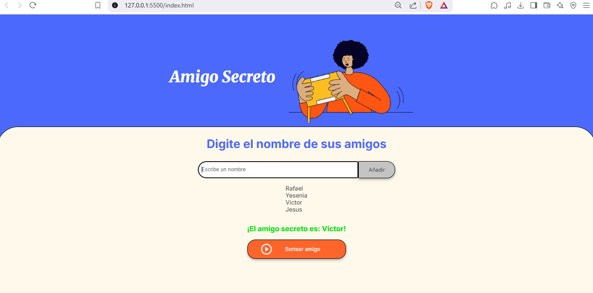

# Challenge_Amigo_Secreto_One

Descripción

Esta aplicación web permite realizar un sorteo de "Amigo Secreto" de manera sencilla. Los usuarios pueden agregar nombres a una lista y, al finalizar, realizar un sorteo aleatorio para determinar quién es el amigo secreto.

Características ✨

Agregar nombres a una lista.

Validar que los nombres no estén vacíos ni contengan números.

Visualizar la lista de nombres ingresados.

Realizar un sorteo aleatorio.

Mostrar el resultado en pantalla.

Tecnologías utilizadas 🛠️

HTML: Estructura de la página.

CSS: Estilos visuales (definidos en style.css).

JavaScript: Lógica de la aplicación (archivo app.js).

Estructura del Proyecto 📂

AmigoSecreto/

│── index.html    # Estructura principal de la aplicación

│── style.css     # Estilos visuales

│── app.js        # Lógica de la aplicación

│── assets/       # Imágenes y otros recursos

Instalación y Uso 🚀

Clona este repositorio o descarga los archivos.

Abre el archivo index.html en un navegador.

Ingresa los nombres en el campo de texto y haz clic en "Añadir".

Una vez agregados los nombres, haz clic en "Sortear amigo" para obtener un resultado aleatorio.

Código Principal 📜

El archivo app.js contiene tres funciones principales:

agregarAmigo()

Obtiene el nombre ingresado y lo valida.

Agrega el nombre al array si es válido.

Llama a actualizarLista() para mostrar los nombres.

actualizarLista()

Muestra todos los nombres en la interfaz.

sortearAmigo()

Selecciona un nombre al azar de la lista.

Muestra el resultado en pantalla.

Captura de Pantalla 🖼️

Autor 💡

Desarrollado por Rafael Arteaga
